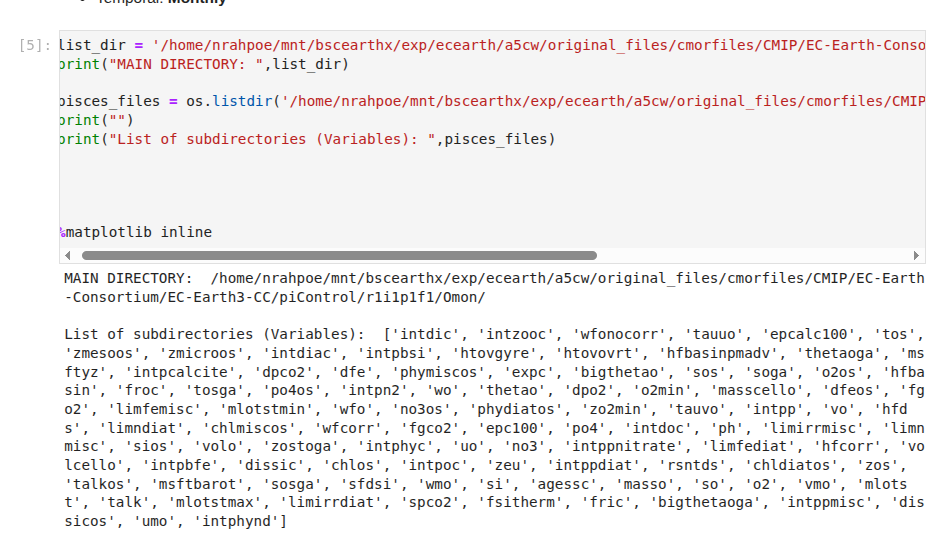
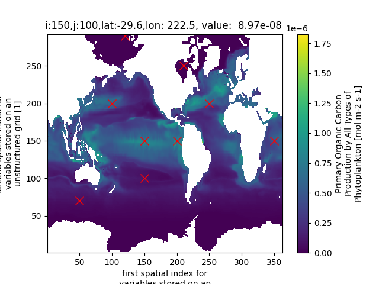
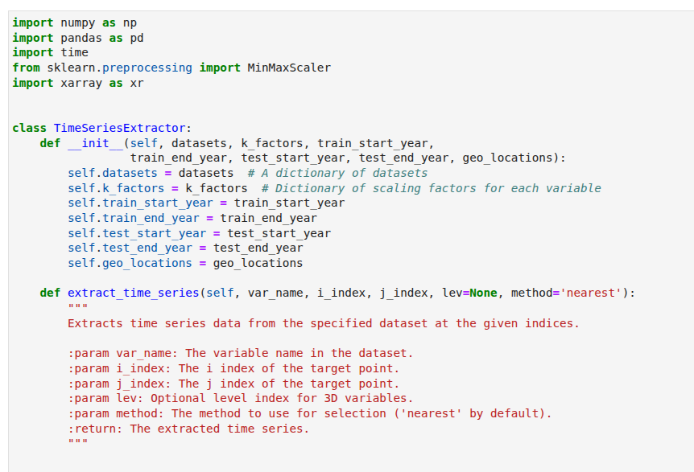
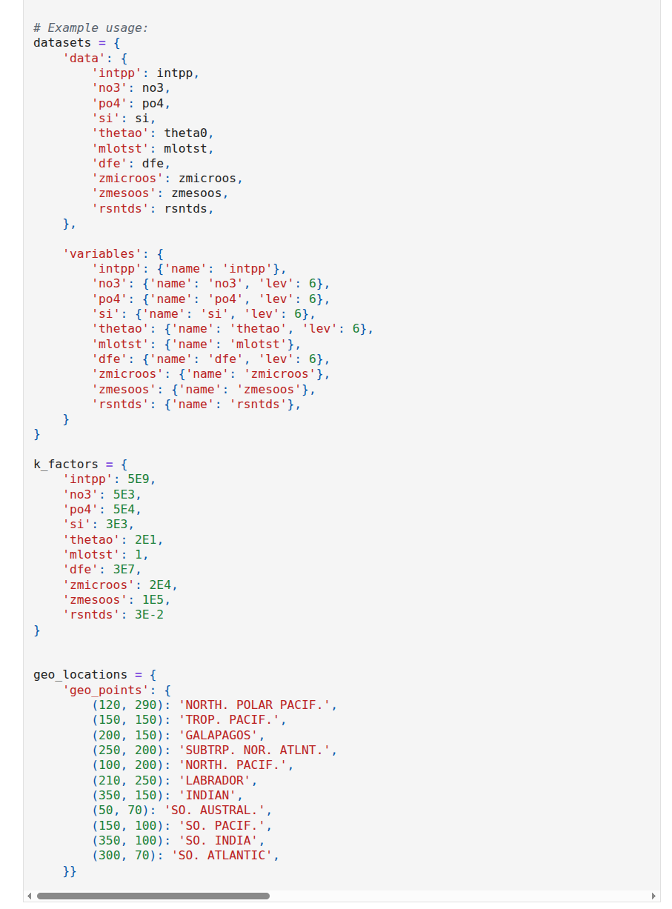
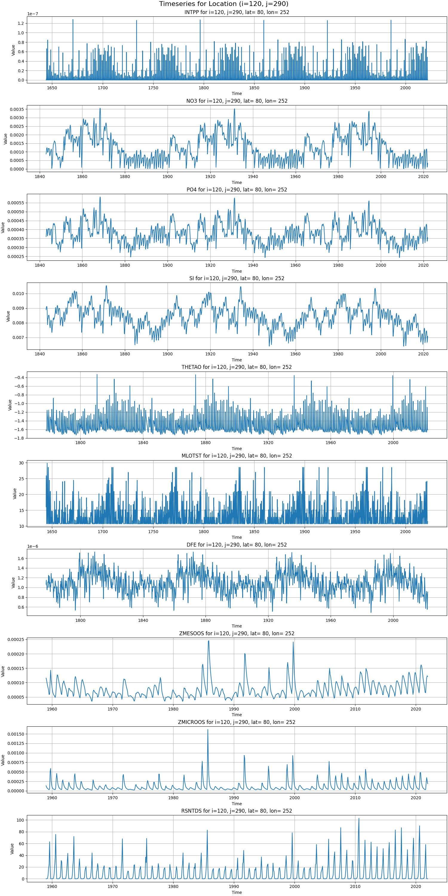
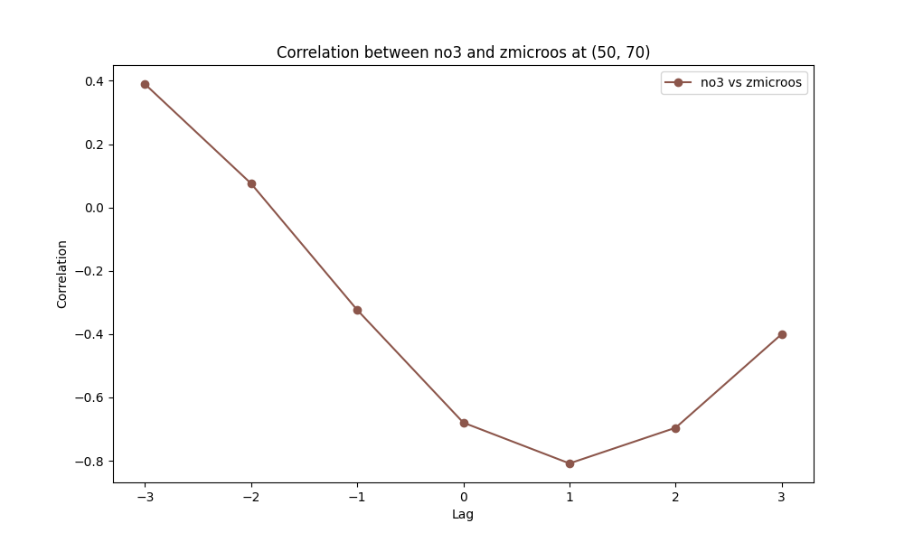
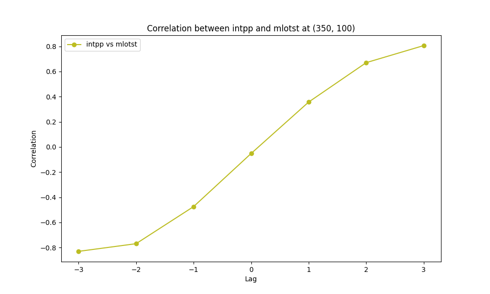
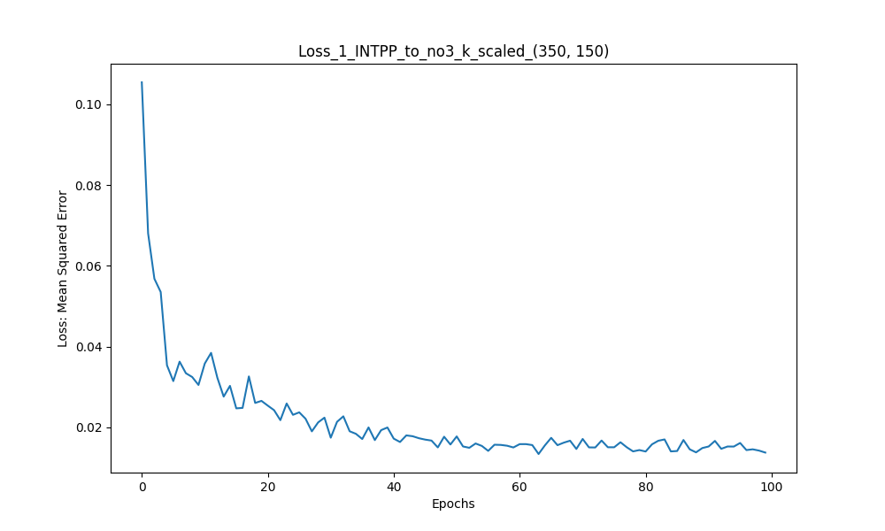

# Tutorial

**Step by Step tutorial of the notebook**

The output of the notebook has been supressed to keep the size of the notebook small. The user can download the notebook and run it in own environment or on colab.
The preliminary to run the notebook are the data set that should be available and downloaded beforehand.

**Dataset**
  
- Ocean Monthly Mean dataset from CMIP EC-Earth3 simulation of pre-industrial control and of 1ºx1º grid resolution with different geo-location samples.
  

  
**Varialbes**

For this work we only use 9 variables for testing:

- **Z(t) = INTPP** : net_primary_mole_productivity_of_biomass_expressed_as_carbon_by_phytoplankton [mol m-2 s-1]

- **Z(t-1) = INTPP Lag 1**: "

- **A(t) = NO3 3D** (Column integrate 200m or at const. level): mole_concentration_of_nitrate_in_sea_water [mol m-3]

- **B(t) = PO4 3D** (Column integrate 200m or at const. level): mole_concentration_of_dissolved_inorganic_phosphorus_in_sea_water [mol m-3]

- **C(t) = Si 3D** (Column integrate 200m or at const. level)

- **D(t) = THETAO 3D** (Column integrate 200m or at const. level): sea_water_potential_temperature [degC]

- **E(t) = MLOTST**: ocean_mixed_layer_thickness_defined_by_sigma_t [m]

- **F(t) = DFE 3D** (Column integrate 200m or at const. level): mole_concentration_of_dissolved_iron_in_sea_water [mol m-3]

- **G(t) = ZMESOOS** (Surface) Only from 1959..onwards: Surface Mole Concentration of Mesoozooplankton expressed as Carbon in Sea Water [mol m-3]

- **H(t) = ZMICROOS** (Surface) Only from 1959..onwards: Microzooplankton [mol m-3]

- **I(t) = RSNTDS** (Surface): Net Surface Downward Shortwave Radiation at Surface [W m-2]

## Mathematical Background

The algorithm is based on solving a auto-regressive (AR1) multi-variate equation by using Recurrent Neural Networks following equation:

$$
z(t) = z(t-1) + \sum_{i=0}^{n} a_i x_i(t)
$$

Where $n$ represents the number of independent variables $$x_i$$ on the dependent variable $$z(t)$$. Autoregressive **AR(1)** with time lag 1 $$z(t-1)$$.

## Time Series Extractor Class
  
In this class all the functions are defined that used to extract, normalize, transform, impute, convert to a data frame, using the time lag series, applying and calculating the cross correlation between variable series, and to define a dictionary for naming, the level at which the 3D data should be exctracted to have a point wise 1D series, the constants for the transformation of the values and the geo-location indices to be used as samples.

  

  
 
## Run Time Series Extractor
 
In this code block, the class object is defined as extractor object, that can  be used to run certain functions
- normalise the series
- create training and test data frames
- calculate the pairwise cross-correlation of the series and saving them into CSV format

## Cross-correlation plots

In this section the pair-wise cross correlation is calculated to observe if any time dependent connection between variables exists. This might be usefull for longer time dependencies or correlated error estimation.

  
  
 
## Model

Using the LSTM (Long Short Term Memory) for prediction

- Define the LSTM model architecture
- model = Sequential() For timeseries the Sequential Keras class is suitable
- model.add(LSTM(64, input_shape=(time_steps, 1))) Add LSTM cell into the Sequential architectur
- model.add(Dropout(0.2)) # Add dropout layer with a dropout rate of 0.2
- model.add(Dense(1)) Predict the next step of the time series
- model.compile(optimizer='adam', loss='mean_squared_error')

At the end the model will be compiled with an Adam optimizer (A gradient descent method to reach the minimum cost function) and the loss (cost function) of Mean Squared Error (Similar to Least Square Fit).

# Define scaled training and test sequences

- look_back = 12  # Number of time steps to look back
- X, Y = create_dataset(scaled_data, look_back)

# Define and train the LSTM model
- model = Sequential() */For time series or sequenced data*/
- model.add(LSTM(units=50, input_shape=(X.shape[1], X.shape[2])))

# Add dense layers
- model.add(Dense(units=32, activation='relu')) *Dense layer that transforms with ReLu. A function that converts all negative values into zero*
- model.add(Dense(units=1, activation='linear'))  *For predicting a single output*
- model.add(Dropout(0.1)) *Adding dropout, to avoid overfitting (omitting 10% of data points)*
- model.add(Dense(units=1)) *1D output of predicted value*
- model.compile(optimizer='adam', loss='mean_squared_error')
- model.fit(X, Y, epochs=100, batch_size=32, verbose=0) *100 epochs (trials). At each epoch, the data sets are split into 32 sequenced batches (better digestible for the system)*
- Since the model is blind at the begin and just uses random weights, so at first epoch or trial, the error is maximum. Imagine a cloud of data points where a line should be drawn. The first line is randomly selected. The loss is calculated. Then in the next iteration, the weights are changed. At second epoch, again the error is calculated. The weights are updated according to gradient descent, toward the minimum of mean squared error. Again the loss is calculated...etc until the last epoch, where the error should be lower. One can also define the error convergence (Early Stopping scheduler) to avoid too many epoch iterations.

  
